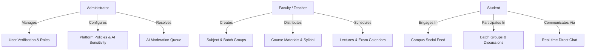

**UCS503: Software Engineering (Project)**  
**Thapar Institute of Engineering & Technology (TIET), Patiala**

# CampusConnect — Academic & Social Networking Platform

**Team Members:**
- **Aayushmaan Singh Meyan** (Roll No. `1024240142`) — [Member Journal](journals/1024240142-aayushmaan/index.md)
- **Divyansh Jasrotia** (Roll No. `1024240008`) — [Member Journal](journals/1024240008-divyansh/index.md)
- **Prakhar Saxena** (Roll No. `1024240019`) — [Member Journal](journals/1024240019-prakhar/index.md)

---

## 1. Executive Summary & Motivation

In modern academic environments, communication is deeply fragmented across informal WhatsApp groups, Telegram channels, and chaotic email threads. This fragmentation causes missed academic deadlines, unverified circulars, lack of access control, and lost lecture materials.

**CampusConnect** is a closed-community, role-aware academic and social networking platform built for higher education institutions. It provides an institution-verified space that integrates:
- **Role-Based Access Control (RBAC):** Distinct workflows tailored for **Students**, **Teachers**, and **Administrators**.
- **Course & Batch Hubs:** Groups dedicated to subjects, lab sections, and student batches with centralized lecture notes and syllabus materials.
- **Academic Schedule Board:** Centralized calendar tracking lectures, assignment deadlines, and exam schedules with automated notifications.
- **Real-Time Communication:** Direct 1-on-1 messaging and live notification alerts powered by WebSockets.
- **Agentic AI Moderation:** Automated sentiment and policy scanning powered by Google Gemini AI to maintain a safe campus community.

---

## 2. System Architecture & Tech Stack

The platform is designed with a modern, decoupled full-stack architecture located in the [`code/`](../code) folder:

| Layer | Technology | Purpose |
|:--|:--|:--|
| **Frontend & SSR** | Next.js 16.3.4 (App Router, React 19) | Server Components, dynamic client views, and route caching |
| **Language** | TypeScript 5.x | Strict end-to-end type safety |
| **Styling** | Tailwind CSS v4 + Radix UI Primitives | Responsive block-based design system, modals, and toasts |
| **Database** | Neon Cloud PostgreSQL | High-availability PostgreSQL database with connection pooling |
| **ORM** | Prisma 7 (`@prisma/adapter-pg`) | Relational data models, declarative migrations, and type-safe queries |
| **Auth & Security** | NextAuth.js v4 + bcryptjs | Credentials authentication, JWT sessions, and RBAC edge guards |
| **Real-Time Engine** | Socket.io | Instant messaging, typing presence, and notification alerts |
| **Cloud Storage** | Cloudinary CDN | Secure storage and transformation of avatars, PDFs, and media |
| **AI Moderation** | Google Gemini API (`@google/genai`) | Agentic post moderation, hate-speech detection, and text filtering |

---

## 3. Core Roles & Capabilities



### Roles Breakdown
1. **Student:** Verified student feed, batch discussions, study materials downloads, personal & course calendar, real-time messaging.
2. **Teacher / Faculty:** Academic group creation, file uploads (slides, PDFs, assignments), schedule publishing with automated member notifications.
3. **Administrator:** System dashboard, tokenized invitation links, user management table, policy configuration, and flagged content resolution.

---

## 4. Software Engineering Artifacts

### 4.1 UML Diagrams
- **Use Case Diagram:** [View Full Diagram](UML/UseCaseDiagram.png)

### 4.2 Data Flow Diagrams (DFDs)
- **Level 0 (Context Diagram):** [View Level 0 DFD](DFD/Level%200/lvl0.png)
- **Level 1 (System Decomposition):** [View Level 1 DFD](DFD/Level%201/lvl1.png)
- **Level 2 (Detailed Functional Decomposition):**
  - [Subsystem 2.4 — Materials & Course Hub](DFD/Level%202/lvl2.4.png)
  - [Subsystem 2.7 — Real-Time Messaging](DFD/Level%202/lvl2.7.png)
  - [Subsystem 2.8 — Admin Control & Moderation](DFD/Level%202/lvl2.8.png)

### 4.3 Project Schedule & Milestones
- **Gantt Chart:** [Download Excel Plan](simple-gantt-chart_ms.xlsx)

---

## 5. Team Sprint Journals

Each team member documents their weekly development tickets, engineering decisions, and architecture contributions:

- [Aayushmaan Singh Meyan (`1024240142`)](../journals/1024240142-aayushmaan/index.md)
- [Divyansh Jasrotia (`1024240008`)](../journals/1024240008-divyansh/index.md)
- [Prakhar Saxena (`1024240019`)](../journals/1024240019-prakhar/index.md)

---

## 6. Running the Web Application Locally

The complete source code is located in the [`code/`](../code) folder.

```bash
# 1. Enter the application directory
cd code

# 2. Install dependencies
npm install

# 3. Setup environment variables
cp .env.example .env

# 4. Generate Prisma client & sync database
npx prisma generate
npx prisma migrate dev --name init

# 5. Seed default test accounts & batch data
npx tsx prisma/seed.ts

# 6. Start the development server
npm run dev
```

Open [http://localhost:3000](http://localhost:3000) in your browser.

### Default Seeded Test Accounts
| Role | Email | Password | Notes |
|:--|:--|:--|:--|
| **Admin** | `admin@campus.edu` | `Password123!` | Full control panel & moderation queue |
| **Teacher** | `teacher@campus.edu` | `Password123!` | Group creation & material uploads |
| **Student** | `alex@campus.edu` | `Password123!` | Sophomore CSE student |
| **Student** | `priya@campus.edu` | `Password123!` | Junior CSE student |
